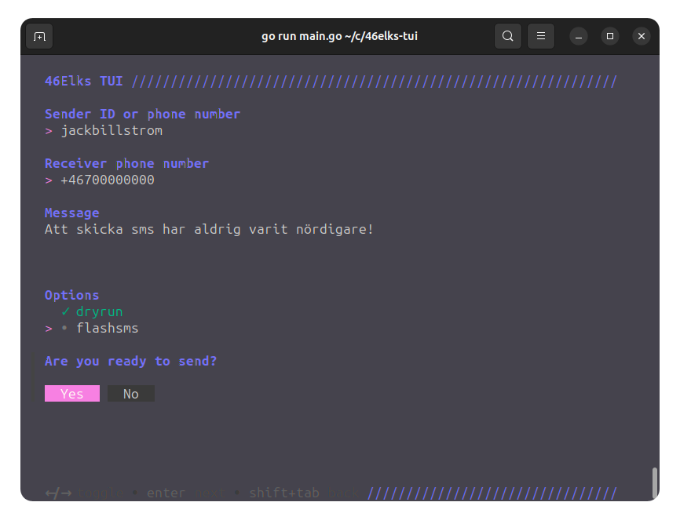

**A simple terminal application written in Go for sending SMS messages using the 46 Elks API.**

*This project has nothing to do with the 46 Elks company, and is not supported of affiliated with them in any way.*


... or by simply `./elks --from "SenderID" --to "+46700000000" --text "Hello world!"`

## Compile
Navigate to the project directory and run the following command to compile the program. This will create an executable file named `elks`.

```bash
go build main.go -o elks
````

## Run
To run the program, simply type the name of the executable file.

```bash
./elks
```

## Usage
The program will ask you for your 46 Elks API credentials. You can find them on the [API account page](https://46elks.se/account).
This will be needed to send SMS messages, and the program will not work without them.

Set your 46 Elks username and password as environment variables:

Unix/Linux:
```bash
export 46ELKS_API_USERNAME=yourusername
export 46ELKS_API_PASSWORD=yourpassword
./elks --from "SenderID" --to "+46700000000" --text "Hello world!"
```

Windows (PowerShell):

```ps1
$env:46ELKS_API_USERNAME = 'yourusername'
$env:46ELKS_API_PASSWORD = 'yourpassword'
./elks.exe --from "SenderID" --to "+46700000000" --text "Hello world!"
```

## License
This project is licensed under the MIT License—see the [LICENSE](LICENSE) file for details

## Acknowledgments
* [46 Elks.se](https://46elks.se) - provides a great API for sending SMS messages.
* [Golang.org](https://golang.org) - a great programming language.
* [huh @ github](https://github.com/charmbracelet/huh/) - a great library for creating terminal user interfaces. With great documentations and examples.
* [bubbletea @ github](https://github.com/charmbracelet/bubbletea/) - a great library for creating terminal user interfaces. With great documentations and examples.

